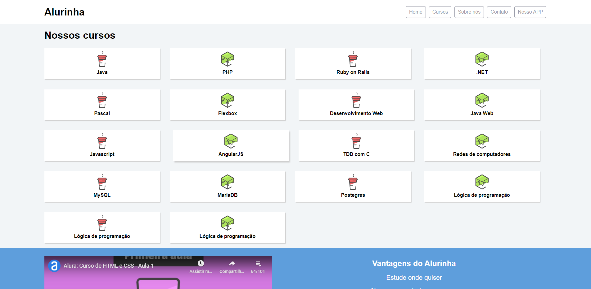
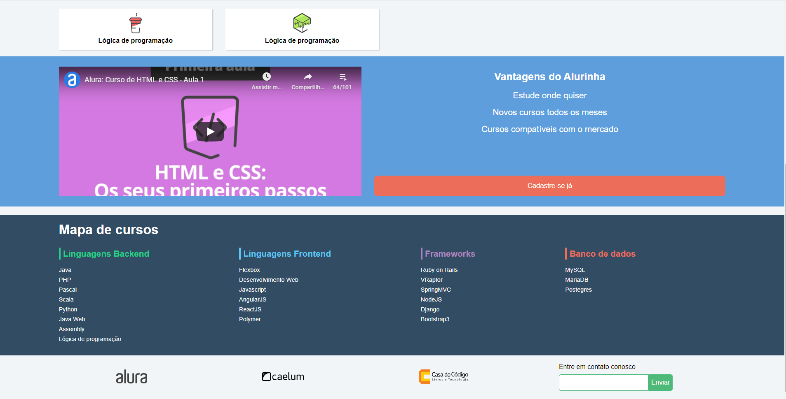
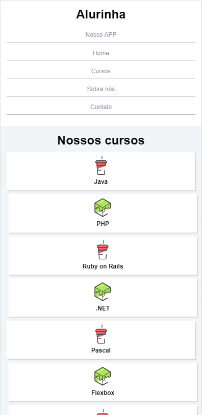
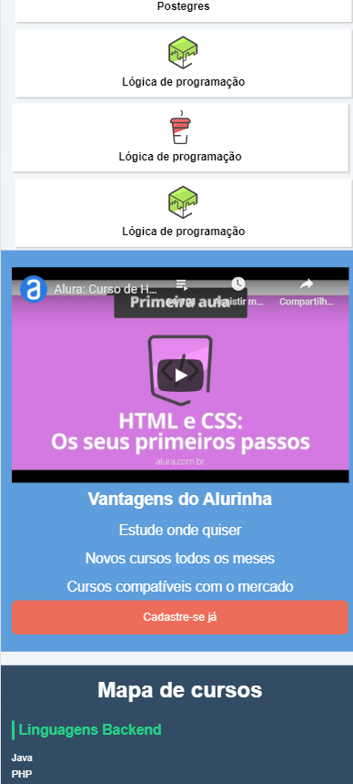
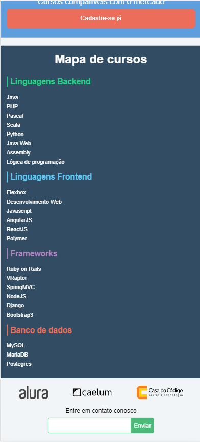

# :computer: Tecnologias
Esse projeto foi desenvolvido com base no curso de **Flexbox: Posicione elementos na tela** https://www.alura.com.br/

* [HTML](https://developer.mozilla.org/pt-BR/docs/Web/HTML)      
* [CSS](https://www.hostinger.com.br/tutoriais/o-que-e-css-guia-basico-de-css/)      
* [CSS - Display: Flex](https://origamid.com/projetos/flexbox-guia-completo/)      

# :grey_question: O que é Flexbox

* O Flexbox é um conceito do CSS3 que visa organizar os elementos de uma página HTML dentro de seus containers de forma dinâmica. Ou seja, independente das suas dimensões eles sempre manterão um layout flexível dentro do seu elemento pai, reorganizando-se e acordo com a necessidade.

# 🚀 Objetivos

* Desenvolver novas habilidades utilizando os conceitos de Flexbox

 
 

## Resultado final

### Desktop

 
 

 
 
### Mobile

 
 

 
 

